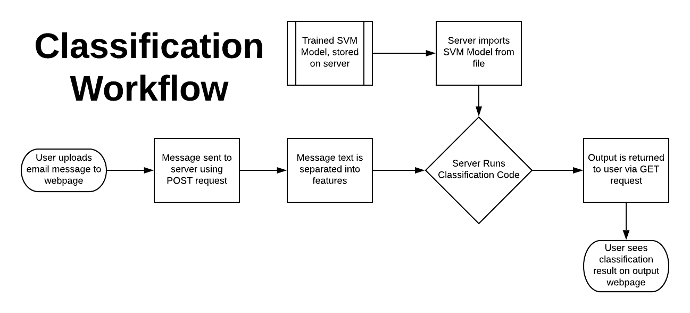

# Welcome to Spamalot!

## Abstract

## Introduction

The goal is the creation of a service that can classify spam emails. By the term
"spam email", we refer to emails that are sent with malicious intent against the
recipient. Emails without malicious intent will be referred to as a "ham
email". We are exploring the possibility of predicting malicious intent in a
given email using a machine learning algorithm.

Classifying malicious emails can prevent harmful situations for users who are
unaware of the dangers of phishing. Links in these emails can lead to dangerous
websites or download viruses and other unwanted software, so it is important to
classify spam emails accurately.

It is also important to minimize the number of false positives - i.e. minimize
the number of ham emails that are erroneously labeled as spam. This practice
would be quite unfriendly to the user.

## The Algorithm

We considered two main algorithms for our implementation of spam classification:
the Naive Bayes and Support Vector Machine (SVM) algorithms.

Classically, Naive Bayes classifiers are typically used for spam filtering and
document classification problems (khorsi2007overview). The Naive Bayes algorithm
relies on Bayes' probability theorem, which expresses a relationship between the
probability of the occurence of an event E given the occurence of other events,
x1 through xn (zhang2004optimality). In terms of classification, event E would
be the classication of a data point, and x1 through xn are the features of that
data point. The underlying assumption of the Naive Bayes classifier is that each
of the features are independent of the value of the class variable, which
simplifies the calculations significantly. As a result, this classification
method is fast compared to more sophisticated methods. Despite the "naive"
assumptions of the independence of each feature, the end classification
sensitive to the distribution of dependencies between all features
(zhang2004optimality), which makes this method successful when classifying
trends in natural language situations.

SVM is also used to work with natural language classification
(khorsi2007overview). SVM models construct hyper-planes in the feature space of
the dataset which can be used for classification. The hyper-plane is chosen by
finding the optimal plane that maximizes its margins of separation between
points of all classes (gunn1998support). In other words, data points are
separated from the others based on their features in an optimal manner. SVM
algorithms are very effective classifiers when working with datasets that
utilize a large number of features (gunn1998support). In the case of emails, we
can calculate the frequency of words contained in the email, which will be a
vector with a large number of features (khorsi2007overview). As a result, SVM is
an appropriate model to classify spam emails due to the high dimensional
dataset.

Both the machine learning algorithms above are supervised learning
algorithms. Both algorithms have weaknesses. The Naive Bayes algorithm works
best when dependencies distribute evenly in classes (zhang2004optimality), but
if this is not the case, Naive Bayes will not be optimal. SVM is much slower
than Naive Bayes, but typically tend to be more statistically robust
(sculley2007relaxed). We experimented with both algorithms and chose which one
to use based on their performance and respective statistics.

## The Dataset

The dataset used to train the machine learning algorithm is taken from a project
that tested the effectiveness of five different variations of Naive Bayesian
classifiers on classifying spam emails. It contains the text of ham and spam
messages from a member of Enron corpus with random ham-spam ratio
(metsis2006spam). These emails are all labeled as ham or spam.

The raw messages of each email generally contain too much information to be
considered useful to train the classifier. We removed punctuation marks and
special characters.

Additionally, previous research has shown the usefulness of lemmatization in
spam filtering (androutsopoulos2000evaluation), which is the process of grouping
together variations of the same root word. For instance, a lemmatizer would
group all instances of the words "include", "includes", and "included" in the
same category. We ran a lemmatizer on the dataset as well.

The filtered emails were then separated into vectors of word frequencies. These
were treated as the features for the machine learning model, with "spam" or
"ham" being the labels.

As standard general practice, we randomly chose 80% of these vectors to train
both the SVM and Naive Bayes models, and used the remaining 20% of these vectors
to assess the quality of each model.

## Model Results

The following image shows the confusion matrix for the Naive Bayes algorithm:

The following image shows the confusion matrix for the SVM algorithm:

Due to the improved overall F1 score of the SVM model, we decided to use the SVM
algorithm for our spam email classifier implementation.

## Implementation
:joy::joy::joy: OMG WHO DID THIS :joy::joy::joy:
The general workflow is as follows:

:new_moon_with_face::full_moon_with_face::sun_with_face:

## Sources
https://staysafeonline.org/stay-safe-online/online-safety-basics/spam-and-phishing/
